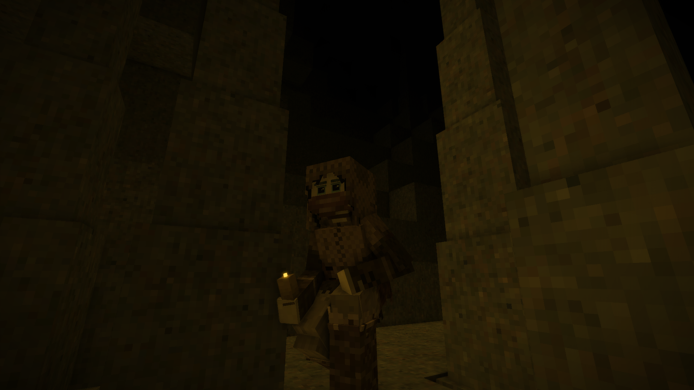

## Item Lights

Candle, why won’t you light my path at night? You glow with fire and yet I stumble around in the darkness…

### Description

Welcome to the GitHub repository for the Vintage Story mod, Item Lights! 

Item Lights is a mod that aims to address an odd inconsistency in Vintage Story. Unlike blocks, items cannot emit light when held in hand or tossed on the ground. This means that a lit candle won’t light up the area, while a torch will. 

This mod gives items the same illumination capabilities as blocks have. Candles, Temporal Gears, and the creative Wand are now light sources with Item Lights.

#### For Modders

Your mods can take advantage of this system too if installed alongside Item Lights! You only need to give your item or block an attribute like this: "itemlight": [0, 0, 6]

Any byte array value that matches this graphic should work(hover to see values): http://tyron.at/vs/vslightwheel.html

### Releases

### Vintage Story 1.14.0+
[Version 1.0.0](https://github.com/TaskaRaine/Item-Lights/releases/download/1.0.0/ItemLights_v1.0.0.zip)